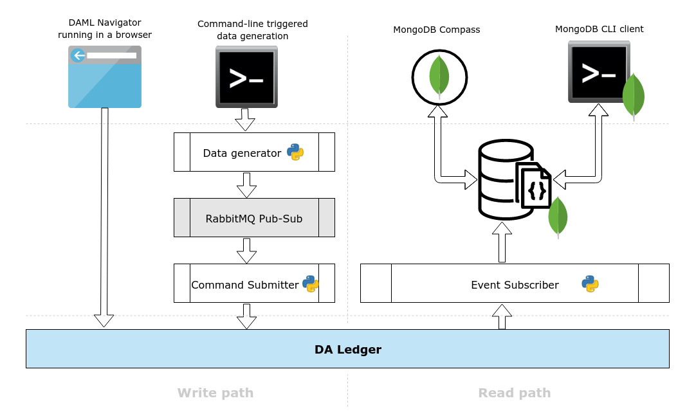
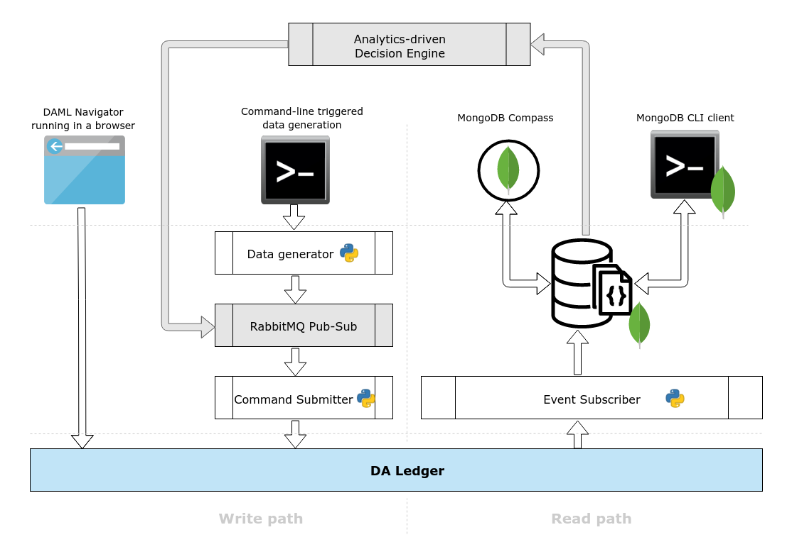

```
Copyright (c) 2019 Digital Asset (Switzerland) GmbH and/or its affiliates. All rights reserved.
SPDX-License-Identifier: Apache-2.0
```

# MongoDB ODS & Analytics on the DA Ledger

## Overview

The aim of this demo is to investigate

- The suitability of using MongoDB as on ODS, storing information from the DA Ledger event stream as documents in a database
- MongoDB's GUI and native aggregation pipeline tools, and how they can be used to drill down into the data

An ODS is an intermediate database for storing state, and in the context of the DA Ledger is a good way to k=have a local representation of the Active Contract Store (ACS) for rendering views, calculating a net position, etc. rather than hitting the ledger each time.

MongoDB is a document database with JSON document format; the DA Ledger document model as per the Python Application Frameworks is also JSON, so it makes sense to use MongoDB for the ODS, with the added benefit of powerful and sophisticated queries and aggregation in real-time.

### The Data Set

To power the demo, sample movie ratings data have been used to provide a suitably large sample set which is both diverse, but can be aggregated upwards into summary information. Each movie rating record also contains randomly generated submitter information, which can be used to try and map behaviour to demographics.

There are two primary record types - `Person` and `Rating` - which capture the rater and the rating. A rater can have multiple ratings, and movies to which the ratings pertain to are not unique. 

There is also a single `Analyst` record, which is the operater user under whom records and ratings are submitted. This is also the user under whom the listener nanobot runs to subscribe to the ledger event stream

## Architecture

The key elements to the demo are listed below:

1. The DA Ledger
1. MongoDB running in a Docker container, serving as the ODS
1. Event Subscriber service ("_listener nanobot_") to consume an event stream from the ledger and create documents in MongoDB
1. Payload generation process ("_datagen_") - generates documents and pushes these onto a message queue for consumption
1. A RabbitMQ Pub/Sub queue, running in a Docker container, to accept the documents from datagen, and also handle back-pressure during the data load
1. Command Submitter workers to pop the documents from the MQ and submit commands to the DA Ledger, utilizing the Digital Asset Application Frameworks

Diagramatically:



### Dependencies

| Dependencies |
|---|
| GNU Make |
| Docker (Community Edition) |
| `docker-compose` _(From GitHub, not `apt`)_ |
| Python Pipenv _(via `pip install`)_ |
| DAZL _(Tested for version `5.5.2`)_ |
| MongoDB Compass (Stable) |

## The demo

### Workflow

1. Setup the environment
1. Run the demo
    - Start all services
    - Start the listener nanobot
    - Run the datagen process to generate sample data and submit it to the ledger
1. Use MongoDB's native tools to inspect the data, using the `mongo` CLI client to connect to the database

### Setup the Environment

1. Pull in the required data sources, docker images and dependencies by running:
    ```sh
    $ make setup
    ```

### Running the Demo

1. Spin everything up and start the MongoDB and RabbitMQ containers, open ports, compile DARs, spin up the data submitter pipeline and spin up a Navigator instance on `TCP/4000`. To do this, run:

    ```sh
    $ make start
    ```

1. Set up the subscriber service listener nanobot to read off the ledger and populate MongoDB - open a new terminal and run:

    ```sh
    $ pipenv run python ./app/operator_listener.py --config config.yaml --user Data_Scientist
    ```

1. Open a new terminal and start the datagen nanobot loader by running:
    ```sh
    $ pipenv run python generators/operator_loader.py --config config.yaml --user Data_Scientist --test NUM
    ```

    where `NUM` specifies the number of ratings to submit. This will also create the initial _Data_Scientist_ user, under whom all rater and rating information is loaded onto the ledger.

    If you don't include `--test NUM`, the entire ratings matrix is loaded: 100,836 entries. Please see **Performance Considerations** below.

    To inspect the ledger and the contracts being created, use Navigator. Go to <http://localhost:4000> and login as user **Data_Scientist** (the only option in the dropdown).

### Working with MongoDB's analytics tools


### Cleaning up

1. To shut down the submitter, the sandbox, the containers, and Navigator, run:

    ```sh
    $ make stop
    ```

1. To do a clean up on the runtime logs, run:

    ```sh
    $ make clean
    ```

1. To do a final clean up on the data source directory as well, run:

    ```sh
    $ make data-clean
    ```

### Performance Considerations

The data loader is resource-intensive, and works in two phases:

1. Queue Setup - for each rating in the set:
    1. An user record is generated (if the user doesn't already exist) and pushed onto the MQ
    1. A movie rating record is generated and pushed onto the MQ 
1. Data Submission
    1. Records are popped from the MQ, commands are generated and submitted

Predictably, the total runtime depends on the value of `NUM`; for example - submitting 100K+ ratings (and corresponding users) takes around fifteen minutes to setup the queue, but a LOT longer (in the order of hours) for the submission to complete. 

The runtime, naturally, is dependent on how beefy your system setup is and the number of cores and RAM available to you. It's difficult to determine the exact time breakdown, but different combinations of software and settings do make an impact. The thread multiplier settings in `config.yaml` are fairly aggressive and pretty much run all cores at 100%, de-tuning that could alleviate some performance lag and lock-ups.

## MongoDB Aggregation Pipeline Operations

The two primary record types are `Person` and `Rating`; what if this was not known? Or you wanted to get a list of movies rated, and drill down from there? This is where MongoDB's Aggregation Operations come into their own.

From MongoDB's own manual:

>"Aggregation operations process data records and return computed results. Aggregation operations group values from multiple documents together, and can perform a variety of operations on the grouped data to return a single result. MongoDB provides three ways to perform aggregation: the aggregation pipeline, the map-reduce function, and single purpose aggregation methods."

This demo focuses on Aggregation Pipelines, the preferred method for investigating data. In a nutshell - records in a collection go through a multi-stage pipeline, where in each stage query and filtering operations re performed on the data, and the results are transformed into aggregated sets that input into the next stage of the pipeline - and so forth until the final result is arrived at. 

Other pipeline operations provide tools for grouping, sorting and counting records by specific fields, and also basic statistical functions like averages, summations, etc.

Connect to the MongoDB database and list available databases:

```sh
$ make db-cli
docker run -i -t --rm mongo:latest sh -c "mongo 172.17.0.1"
MongoDB shell version v4.0.9
connecting to: mongodb://172.17.0.1:27017/test?gssapiServiceName=mongodb
...
> show databases
admin          0.000GB
config         0.000GB
local          0.000GB
movie_ratings  0.000GB
> 
```

The ODS is in the `movie_ratings` database - use this database:

```sh
> use movie_ratings
switched to db movie_ratings
> 
```

A few sample native aggregation operations are below: 

1. Find all contract types, and the number of contracts for each:
    ```sh
    > db.Data_Scientist_acs.aggregate([
      { $group: { _id: "$contractType", count: { $sum: 1 } } }
    ])
    { "_id" : "Main.MovieRatings:Rating", "count" : 100836 }
    { "_id" : "Main.MovieRatings:Person", "count" : 610 }
    { "_id" : "Main.MovieRatings:Analyst", "count" : 1 }
    ```

1. Break down `Person` records by gender:
    ```sh
    > db.Data_Scientist_acs.aggregate([
      { $match: { "contractType": "Main.MovieRatings:Person" }}, 
      { $group: { _id: "$payload.personInfo.gender", count: { $sum: 1 } } }
    ])
    { "_id" : { "Male" : {  } }, "count" : 292 }
    { "_id" : { "Female" : {  } }, "count" : 318 }
    ```

1. Break down `Person` records by title:
    ```sh
    > db.Data_Scientist_acs.aggregate([
      { $match: { "contractType": "Main.MovieRatings:Person" }}, 
      { $group: { _id: "$payload.personInfo.name.title", count: { $sum: 1 } } }
    ])
    { "_id" : { "Mrs" : {  } }, "count" : 118 }
    { "_id" : { "Ms" : {  } }, "count" : 91 }
    { "_id" : { "Mr" : {  } }, "count" : 292 }
    { "_id" : { "Miss" : {  } }, "count" : 109 }
    ```

1. Top 5 most common last name:
    ```sh
    > db.Data_Scientist_acs.aggregate([
      { $match: { "contractType": "Main.MovieRatings:Person" }}, 
      { $group: { _id: "$payload.personInfo.name.lastname", count: { $sum: 1 } } }, 
      { $sort: { count: -1 } },
      { $limit: 5 }
    ])
    { "_id" : "Ward", "count" : 8 }
    { "_id" : "Diaz", "count" : 8 }
    { "_id" : "Patterson", "count" : 7 }
    { "_id" : "Burke", "count" : 6 }
    { "_id" : "Gibson", "count" : 6 }
    ```

1. Find the top rater:
    ```sh
    > db.Data_Scientist_acs.aggregate([
      { $match: { "contractType": "Main.MovieRatings:Rating" }}, 
      { $group: { _id: "$payload.person", count: { $sum: 1 }}}, 
      { $sort: { count: -1 } }
    ])
    { "_id" : "p414", "count" : 666 }
    ```

1. Ratings breakdown for the top rater:
    ```sh
    > db.Data_Scientist_acs.aggregate([
      { $match: { $and: [ 
        { "contractType": "Main.MovieRatings:Rating" }, 
        { "payload.person": "p414"} 
      ] } }, 
      { $group: { _id: "$payload.rating.rating", count: { $sum:1 } } }, 
      { $sort: { _id: -1 } }
    ])
    { "_id" : 5, "count" : 51 }
    { "_id" : 4.5, "count" : 20 }
    { "_id" : 4, "count" : 244 }
    { "_id" : 3.5, "count" : 69 }
    { "_id" : 3, "count" : 133 }
    { "_id" : 2.5, "count" : 36 }
    { "_id" : 2, "count" : 97 }
    { "_id" : 1.5, "count" : 7 }
    { "_id" : 1, "count" : 8 }
    { "_id" : 0.5, "count" : 1 }
    ```

1. Genres:
    ```sh
    > db.Data_Scientist_acs.aggregate([
      { $match: { $and: [ 
        { "contractType": "Main.MovieRatings:Rating" }, 
        { "payload.person": "p414"} 
      ] } }, 
      { $unwind: "$payload.rating.genres" }, 
      { $group: { _id: "$payload.rating.genres", count: { $sum:1 } } }, 
      { $sort: { count: -1 } } 
    ])
    { "_id" : "Drama", "count" : 345 }
    { "_id" : "Comedy", "count" : 274 }
    { "_id" : "Action", "count" : 148 }
    { "_id" : "Thriller", "count" : 139 }	
    { "_id" : "Romance", "count" : 119 }
    { "_id" : "Adventure", "count" : 98 }
    { "_id" : "Crime", "count" : 87 }
    { "_id" : "Sci-Fi", "count" : 72 }
    { "_id" : "Fantasy", "count" : 41 }
    { "_id" : "Children", "count" : 36 }
    { "_id" : "Musical", "count" : 32 }
    { "_id" : "War", "count" : 29 }
    { "_id" : "Mystery", "count" : 29 }
    { "_id" : "Animation", "count" : 25 }
    { "_id" : "Documentary", "count" : 25 }
    { "_id" : "Horror", "count" : 20 }
    { "_id" : "IMAX", "count" : 16 }
    { "_id" : "Western", "count" : 13 }
    { "_id" : "(no genres listed)", "count" : 1 }
    { "_id" : "Film-Noir", "count" : 1 }
    ```

To disconnect, use the key combination `Ctrl+D`:

```sh
> 
bye
```

## Extending the Demo

One of the aims of this demo was to investigate the feasibility of using MongoDB's native aggregation tools - with or without further enrichment - to drive automatic decision-making which results in new commands being submitted to the DA Ledger. 

A potential architecture is below:



This has not been implemented and remains to be done by the user.

## Links

- DAML: <https://daml.com>
- `docker`: <https://docs.docker.com/install/linux/docker-ce/ubuntu/>
- `docker-compose`: <https://docs.docker.com/compose/install/>
- MongoDB Compass: <https://www.mongodb.com/download-center/compass?jmp=hero>
- Random user generation: <https://randomuser.me/documentation>
- Movie ratings data set: <https://grouplens.org/datasets/movielens/>
- MongoDB Manual - Aggregation <https://docs.mongodb.com/manual/aggregation>

## Contributing

We welcome suggestions for improvements via issues, or direct contributions via pull requests.
